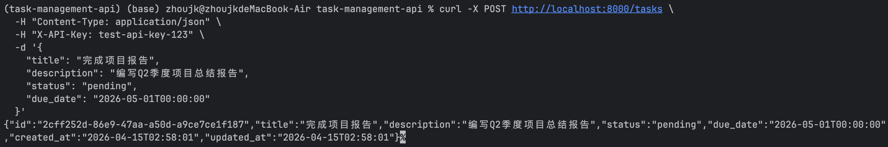
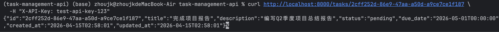
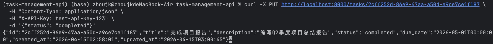
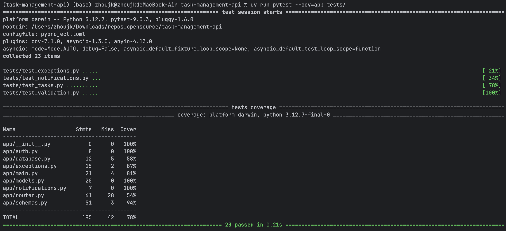

# 任务管理 API

基于 FastAPI 构建的 RESTful 任务管理 API，支持 CRUD 操作、异步通知、API Key 认证及完善的测试覆盖。

## 快速开始

```bash
# 安装依赖
uv sync

# 复制并编辑配置文件
cp config.example.yaml config.yaml

# 启动服务
uv run uvicorn app.main:app --reload
```

启动后访问 `http://localhost:8000/docs` 查看交互式 Swagger 文档。

## API 接口

| 方法 | 路径 | 说明 |
|--------|------|------|
| POST | `/tasks` | 创建任务 |
| GET | `/tasks` | 获取任务列表（支持按状态过滤） |
| GET | `/tasks/{id}` | 获取指定任务 |
| PUT | `/tasks/{id}` | 更新任务 |
| DELETE | `/tasks/{id}` | 删除任务 |

所有接口需要在请求头中携带 `X-API-Key` 进行认证。

## 使用示例

### 创建任务



```bash
curl -X POST http://localhost:8000/tasks \
  -H "Content-Type: application/json" \
  -H "X-API-Key: 你的API密钥" \
  -d '{
    "title": "完成项目报告",
    "description": "编写Q2季度项目总结报告",
    "status": "pending",
    "due_date": "2026-05-01T00:00:00"
  }'
```

请求体字段：

| 字段 | 必填 | 说明 |
|---|---|---|
| `title` | 是 | 任务标题（1-200 字符） |
| `description` | 否 | 任务描述 |
| `status` | 否 | 状态，默认 `pending`。可选值：`pending`、`in_progress`、`completed` |
| `due_date` | 否 | 截止日期（ISO 8601 格式，必须是将来的时间） |

返回示例：

```json
{
  "id": "a1b2c3d4-...",
  "title": "完成项目报告",
  "description": "编写Q2季度项目总结报告",
  "status": "pending",
  "due_date": "2026-05-01T00:00:00",
  "created_at": "2026-04-15T10:00:00",
  "updated_at": "2026-04-15T10:00:00"
}
```

### 查看任务是否完成



查询指定任务，返回的 `status` 字段即为任务状态：

```bash
curl http://localhost:8000/tasks/{task_id} \
  -H "X-API-Key: 你的API密钥"
```

状态值含义：`pending`（待处理）、`in_progress`（进行中）、`completed`（已完成）。

也可以按状态筛选任务列表：

```bash
curl "http://localhost:8000/tasks?status=completed" \
  -H "X-API-Key: 你的API密钥"
```

### 将任务标记为完成



```bash
curl -X PUT http://localhost:8000/tasks/{task_id} \
  -H "Content-Type: application/json" \
  -H "X-API-Key: 你的API密钥" \
  -d '{"status": "completed"}'
```

任务被标记为 `completed` 时，系统会自动触发通知（根据 `config.yaml` 中 notifications 配置）。

## 测试



```bash
# 安装开发依赖（pytest、pytest-cov、ruff 等）
uv sync --extra dev

# 运行测试并生成覆盖率报告
uv run pytest --cov=app tests/

# 代码风格检查
uv run ruff check .
```

## 配置说明

将 `config.example.yaml` 复制为 `config.yaml`，按需调整以下配置项：

- `server` — 服务主机地址和端口
- `database` — SQLAlchemy 异步数据库连接 URL
- `auth.api_key` — 接口认证密钥
- `notifications` — 邮件通知相关配置
- `logging.level` — 日志级别（DEBUG、INFO、WARNING、ERROR）
